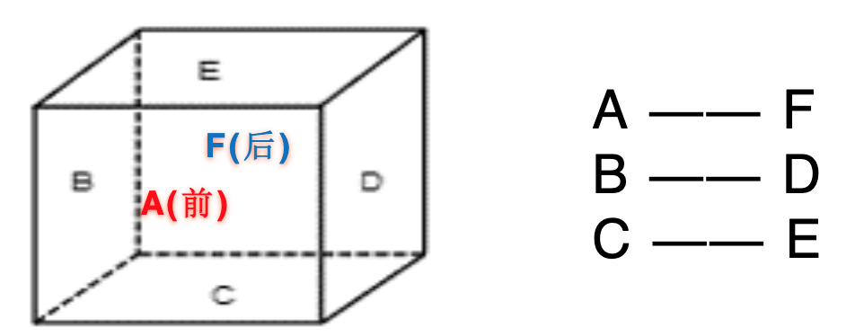
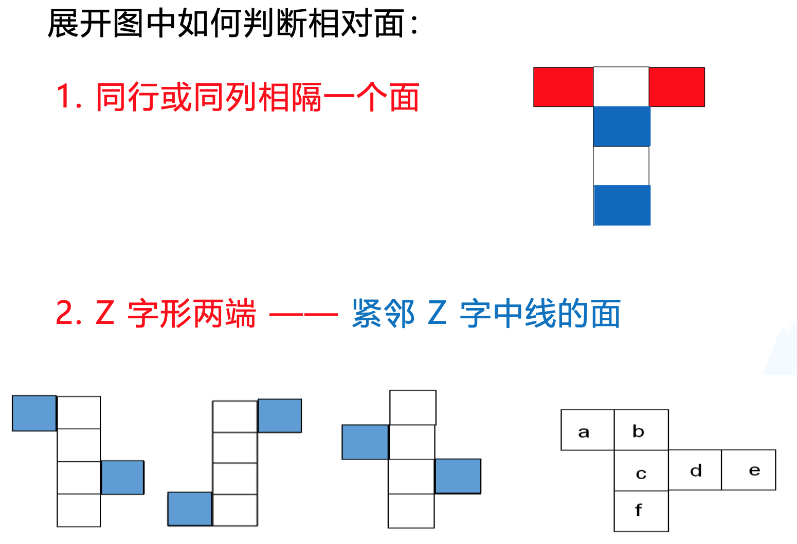
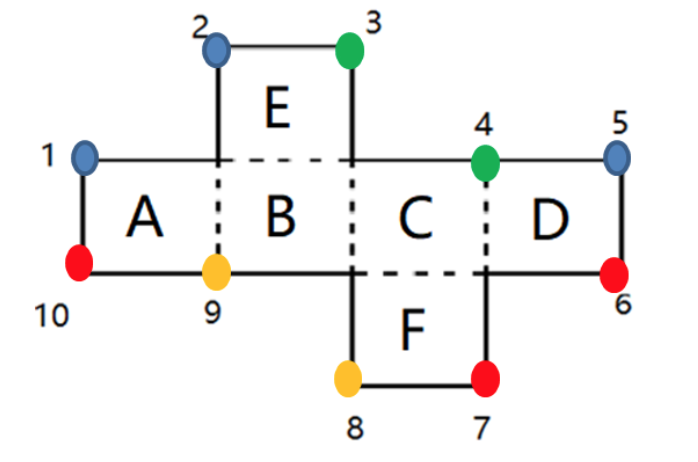
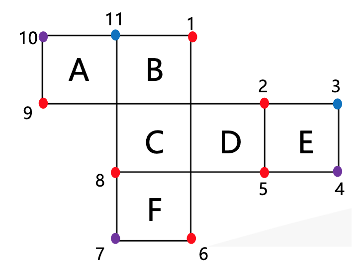

本节课是专项课，讲解判断图形推理中空间类的小技巧。很多人比较害怕，觉得自己的空间想象力不强，做题比较吃力。大概可以分为四类，分别是空间重构的六面体折纸盒（给出展开图，看折叠后是什么样子）、立体拼合的俄罗斯方块类（给小方块，然后组合起来看样子）、三视图、截面图，根据考情，考查相对稳定的是前两类，所以本节课主要学习这两类。

空间重构之六面体折纸盒：做题基本上有2种思路。

1.依靠想象力解题：有些人的空间想象力比较强，可以利用空间想象力解题，但要搞清楚折叠方向。题干会给出纸盒外表面的展开图，应该像左图一样，不能像右图一样，否则图案会包在里面。

2.大多数情况下很难依靠想象力解题，所以应该依靠技巧。要知道所有的技巧都是排除错误选项的，主要用排除法解题，知道选项错误就排除。

## 1.相对面

面A和面F一组，分别是一前一后。面B和面D一组，分别是一左一右。面C和面E一组，分别是一下一上。互为一组的面被称为相对面。这是透视图，但考试时展现的图形并不是如此，只能看到其中的3个面，看不到被遮挡的面。

特征：两个相对面能且只能看到一个面。在只能看到3个面的情况下，不能同时看到一组相对面。如果有选项同时出现了互为相对面的2个面，则该项错误。

同行或同列相隔一个面的两个面是相对面：如第一行例图，2个红面位于同一行，中间隔着1个白面，这2个红面是相对面；2个白面间隔1个蓝面，互为相对面；2个蓝面间隔1个白面，互为相对面。

2.位于“Z”字形两端，而且紧邻“Z”字中线的两个面是相对面。
（1）如第二行图1，面1和面3是相对面，面2和面4是相对面，六面体有3组相对面，那么剩余的面5和面6是相对面。连接面5和面6，会构成“Z”字形，同时“Z”字形还可以是图2、图3的形式。

## 2.公共边与公共点

1.除了学习相对面，还有其他方法来帮助排除错误选项，非常常用的方法是利用公共边、公共点。

2.右侧是平面展开图，考试时会要求将其折叠起来。

- 1）若要求确定面A和面B的公共边，则非常容易，是中间挨着的边，面B和面C、面C和面D的公共边同理。
- 2）面A和面E有边相互垂直，展开图相互垂直的2条边会在折叠后重合，这就是利用直角关系中的公共边。同理，面E和面C、面B和面F、面F和面D都有垂直关系的边，折叠后是同一条边。当2条边垂直，折叠后会重合，那么点1和点2会重合，同理，电三和点4、点6和点7、点8和点9会重合。应用最广泛的是直角关系中的公共边/点，掌握这些就足够。

两个面的公共边是唯一的：如果平面展开图中面A和面B的公共边和选项的不一样，那么选项就错误。因为2个面的公共边是唯一的，选项要想正确，就应与平面展开图的公共边对应一致。观察2个面的关系时，可看公共边。

三个面的公共点是唯一的：如果面B、面C、面D的公共点是图中的红点，若选项这3个面的公共点与之对应不一致，则错误。观察3个面的关系时，除了可以看公共边，还可以看公共点。当3个面在一起时，观察公共点更加容易。

出现带颜色的面，可以看公共边的颜色来做排除。
